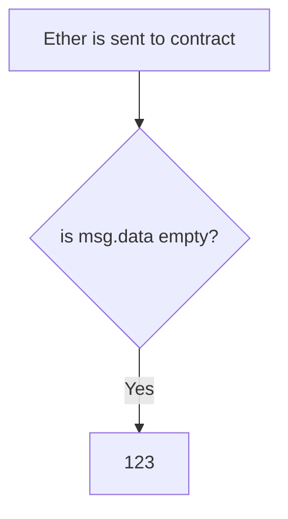

# SmartContracts

學習智能合約的漏洞與攻擊方式

會從 [這個頻道](https://www.youtube.com/channel/UCJWh7F3AFyQ_x01VKzr9eyA) 學習並寫成學習筆記，偶爾會自己補充一些範例。

```mermaid
  flowchart TD
      A[Ether is sent to contract]-->B{is msg.data empty?};
      B -- Yes --> C[123];
```
